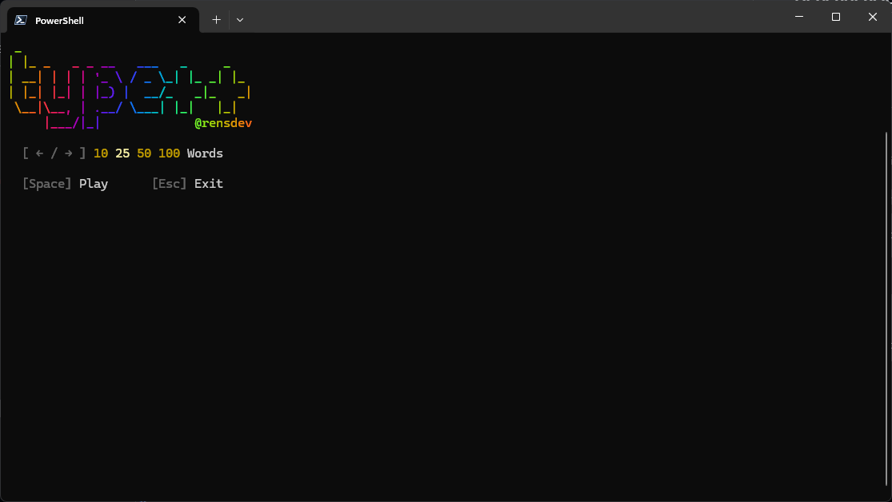

<div align='center'>

</div>

# type++

A typing test game based on [Monkeytype](https://monkeytype.com/), written in C++17.



## Dependencies

* [fmt](https://fmt.dev)
* [cpp-terminal](https://github.com/jupyter-xeus/cpp-terminal)

## Try it out

(Windows only)

Download `type++.exe` on the [latest release](https://github.com/1rens1/type--/releases/latest).

## Building

> [!NOTE]
> This project was developed on Windows using MinGW and CMake.

1. Pull the `cpp-terminal` submodule

   ```sh
   git submodule update --init --recursive
   ```

2. Build the project

   ```sh
   cd build
   cmake -G "MinGW Makefiles" ..
   cmake --build .
   ```
